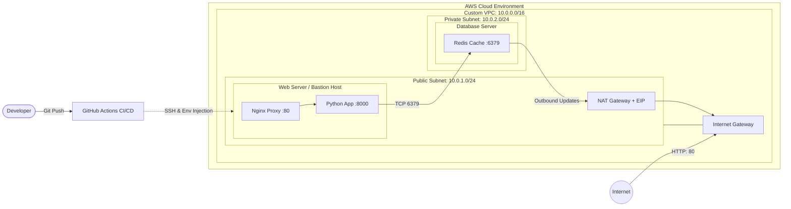

# Zero-Touch AWS Cloud Deployment: Distributed 2-Tier Architecture

## Overview
This repository contains a fully automated, Infrastructure-as-Code (IaC) deployment of a containerized Python web application. It demonstrates a production-grade **Network Segmented Architecture**, separating public-facing web servers from private database servers, all orchestrated via GitHub Actions CI/CD.

## System Architecture

# Core Engineering Competencies
1. _**Network Segmentation & Zero-Trust Security (AWS/Terraform)**__

    **Custom VPC:** Architected a Virtual Private Cloud with public (10.0.1.0/24) and private (10.0.2.0/24) subnets to strictly control traffic flow.

    **The "Vault" Architecture**: Isolated the Redis database in a private subnet with no inbound internet access. Outbound internet access for OS updates is routed securely through a NAT Gateway.

    **Security Group Chaining:** Implemented Zero-Trust security rules. The database Security Group strictly drops all traffic except packets originating directly from the Web Server's specific Security Group ID.

    **Bastion Host Routing:** Utilized the public Web Server as a Jump Box to securely SSH into the private database server for system-level debugging.

2. _**CI/CD Pipeline & Secret Injection (GitHub Actions)**_

    **Zero-Touch Deployment**: Engineered a workflow that triggers on main branch pushes, SSHes into the Web Server, pulls the latest code, and orchestrates Docker Compose.

    **Dynamic Environment Variables**: Pipeline dynamically injects the private IP of the AWS Database server into a .env file at runtime, ensuring the Python container connects securely across the VPC network without hardcoding IPs in the repository.

3. _**Container Orchestration & Reverse Proxying (Docker)**_
   
    **Distributed Services**: Split the docker-compose.yml logic to manage services across multiple physical EC2 hosts.

    **Nginx Reverse Proxy**: Containerized Nginx to act as the web-facing bouncer, protecting the internal Python application from slowloris attacks and abstracting port mapping from the host OS.

# Deployment Lifecycle

  _Provision Infrastructure_: Navigate to terraform/ and run terraform apply. This builds the VPC, subnets, gateways, and both EC2 instances (injecting boot logic via user_data).

  _Configure Pipeline_: Copy the Terraform outputs (Web Public IP, DB Private IP) into GitHub Repository Secrets (EC2_HOST, REDIS_HOST).

  _Automated CI/CD Execution_: Push code to GitHub. The pipeline will automatically connect, inject the private network routes, and spin up the distributed application.

  _Teardown_: Run terraform destroy to cleanly wipe all cloud resources and prevent idle billing. branch. GitHub Actions will handle the SSH connection, code pull, and container orchestration automatically.
