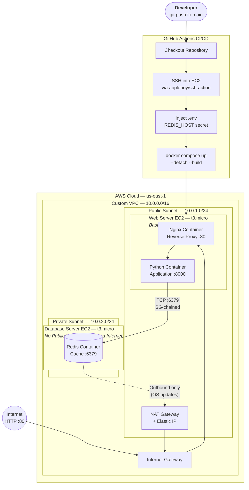
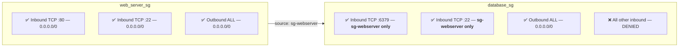
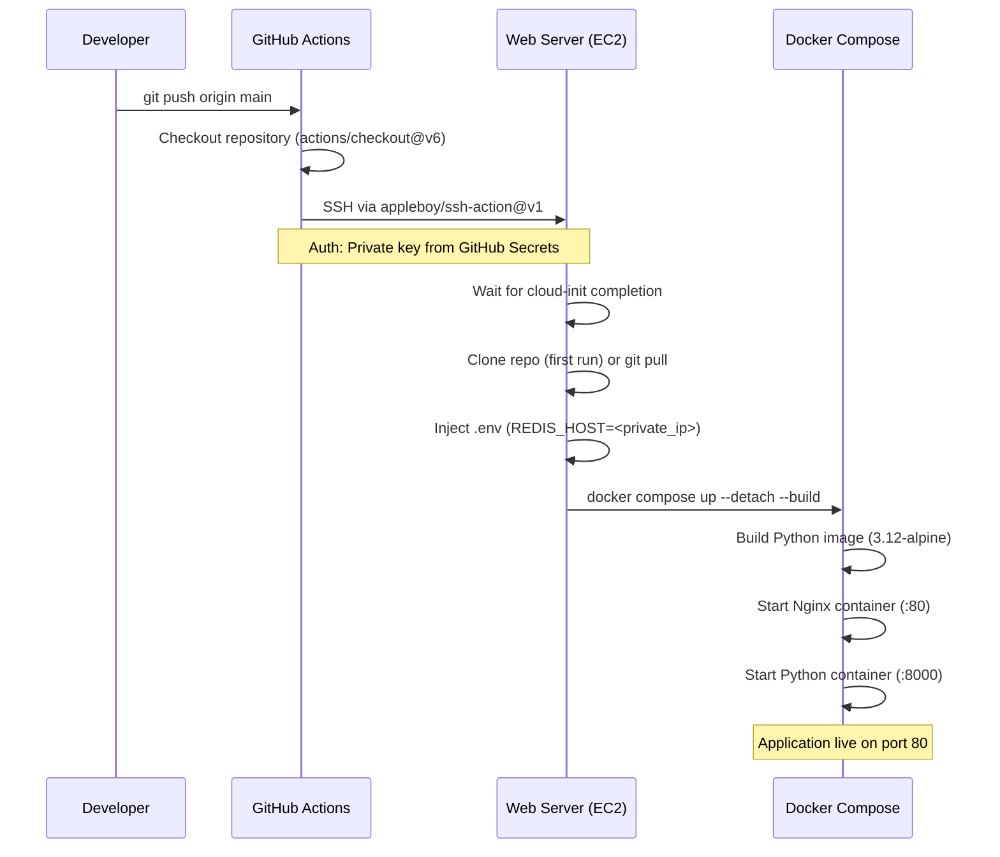
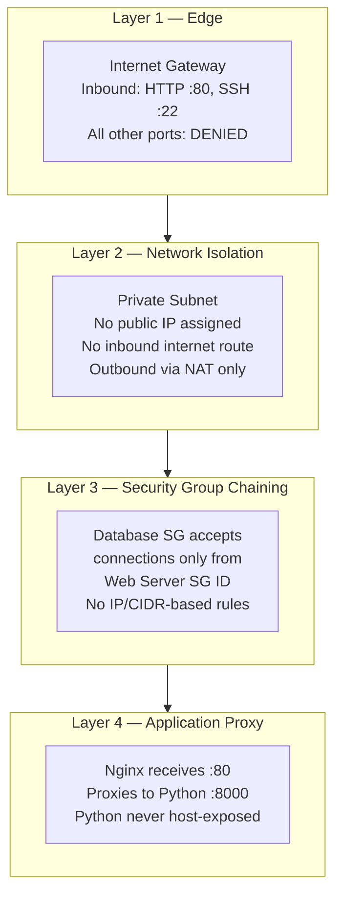

# Zero-Touch AWS Deployment — Automated 2-Tier Cloud Infrastructure


---

## Project Summary

Production-style, fully automated AWS infrastructure that provisions a **network-segmented VPC**, deploys a **containerized application** across two EC2 instances, and delivers code changes to production via a **zero-touch CI/CD pipeline** — all without a single manual step after `git push`.

This project demonstrates hands-on proficiency in:

- **Infrastructure as Code (IaC)** — Terraform provisions all AWS resources declaratively with remote state management
- **Cloud Networking & Security** — Custom VPC with public/private subnet isolation and Security Group chaining
- **CI/CD Pipeline Engineering** — GitHub Actions automates the full deployment lifecycle with secret injection
- **Container Orchestration** — Docker Compose manages multi-container services with Nginx reverse proxying
- **Linux Systems Administration** — EC2 user data scripts, Docker daemon management, SSH bastion host access

---

## Architecture Overview



---

## Technology Stack

| Category | Technology | Purpose |
|---|---|---|
| **Infrastructure as Code** | Terraform (AWS Provider v6) | Declaratively provisions all cloud resources — VPC, subnets, gateways, EC2 instances, security groups, Elastic IPs |
| **Cloud Provider** | AWS (us-east-1) | EC2, VPC, Internet Gateway, NAT Gateway, Elastic IPs, S3 (state backend), Security Groups |
| **CI/CD** | GitHub Actions | Automated deployment pipeline triggered on `push` to `main` — SSH remote execution via `appleboy/ssh-action` |
| **Containerization** | Docker & Docker Compose | Multi-container orchestration — Python app + Nginx reverse proxy, managed via `docker compose up --build` |
| **Reverse Proxy** | Nginx | Fronts the application container, handles HTTP :80 traffic, forwards to the Python backend via Docker networking |
| **Data Store** | Redis | In-memory cache running on the isolated private EC2 instance, accessed cross-subnet via Security Group chaining |
| **Operating System** | Ubuntu 22.04 LTS (Jammy) | Base AMI for both EC2 instances, bootstrapped via Terraform `user_data` shell scripts |
| **State Management** | AWS S3 + Terraform Backend | Remote state stored in a versioned, AES-256 encrypted S3 bucket with native state locking |

---

## Key Engineering Decisions

### 1. Network Segmentation & Least-Privilege Access

Designed a custom VPC (`10.0.0.0/16`) with strict network boundaries:

- **Public subnet** (`10.0.1.0/24`) — Hosts the web server with an Elastic IP. Accepts inbound HTTP (:80) and SSH (:22) only.
- **Private subnet** (`10.0.2.0/24`) — Hosts the database server. **No public IP assigned.** No inbound route from the internet. Outbound traffic is routed exclusively through a NAT Gateway for OS-level package updates.

**Security Group chaining** enforces least-privilege access at the network level:



The database Security Group does **not** reference any IP range or CIDR block — it exclusively accepts connections from the web server's Security Group ID. This ensures that even if the private subnet is accidentally exposed, traffic without the correct security group origin is dropped.

> **Note:** SSH (:22) on the web server is scoped to `0.0.0.0/0` for demo convenience. In a real deployment this would be restricted to a known CIDR or replaced with AWS Systems Manager Session Manager — see [Future Improvements](#future-improvements).

### 2. CI/CD Pipeline — Zero-Touch Deployment

The GitHub Actions workflow (`.github/workflows/deploy.yml`) implements a fully automated deployment:



**Key implementation details:**
- `cloud-init status --wait` ensures EC2 bootstrap scripts have finished before deployment
- First-run detection handles initial `git clone` vs. subsequent `git pull` operations
- The `REDIS_HOST` secret (the database server's private IP) is injected into a `.env` file at deploy time — **no sensitive values are committed to the repository**
- `docker compose up --detach --build` ensures fresh images are built on every deployment

### 3. Container Architecture & Reverse Proxy

Docker Compose orchestrates two containers on the web server:

| Container | Image | Role | Port Mapping |
|---|---|---|---|
| `dashboard_prod` | Custom (Python 3.12 Alpine) | Application server | `expose: 8000` (internal only) |
| `nginx_proxy` | `nginx:latest` | Reverse proxy + HTTP frontend | `ports: 80:80` (host-bound) |

The Python application is **never directly exposed to the host network**. Nginx receives all inbound HTTP traffic on port 80 and proxies requests to the application via Docker's internal bridge network. The `X-Real-IP` header is set to preserve client IP addresses through the proxy layer.

### 4. Remote State Management

Terraform state is stored in an S3 bucket with:
- **Server-side encryption** (AES-256) for state file security
- **Versioning enabled** for state rollback capability
- **Native S3 state locking** (`use_lockfile = true`) to prevent concurrent modifications
- Bucket is provisioned via a separate Terraform module in `terraform/backend-setup/`

---

## Repository Structure

```
zero-touch-deployment-architecture/
│
├── .github/workflows/
│   └── deploy.yml                # CI/CD pipeline — GitHub Actions workflow
│
├── terraform/
│   ├── main.tf                   # EC2 instances, AMI data source, SSH key pair, Elastic IP
│   ├── vpc.tf                    # VPC, subnets, IGW, NAT Gateway, route tables
│   ├── security_group.tf         # Web server SG + database SG (chained)
│   ├── variables.tf              # Region and instance size variables
│   ├── outputs.tf                # Web public IP + DB private IP outputs
│   ├── server_setup.sh           # Web server user_data — installs Docker, Git
│   ├── db_setup.sh               # Database server user_data — installs Docker, runs Redis
│   └── backend-setup/
│       └── main.tf               # S3 state bucket provisioning (versioned, encrypted)
│
├── app/
│   ├── server.py                 # Python HTTP server with /api/status endpoint
│   ├── Dockerfile                # Python 3.12 Alpine image build
│   ├── requirements.txt          # Python dependencies (redis)
│   ├── index.html                # Dashboard frontend
│   ├── style.css                 # Dashboard styles
│   └── script.js                 # Dashboard interactivity
│
├── config/
│   └── pyweb_nginx.conf          # Nginx reverse proxy configuration
│
├── docker-compose.yml            # Multi-container orchestration (Python app + Nginx)
└── .gitignore                    # Terraform state & sensitive file exclusions
```

---

## Deployment Guide

### Prerequisites

- AWS CLI configured with an IAM user (programmatic access)
- Terraform ≥ 1.0 installed locally
- SSH key pair generated at `~/.ssh/aws_ec2_key` and `~/.ssh/aws_ec2_key.pub`
- A GitHub repository with push access

### Step 1 — Provision the Terraform State Backend

```bash
cd terraform/backend-setup
terraform init
terraform apply -auto-approve
```

This creates a versioned, encrypted S3 bucket for remote state storage.

### Step 2 — Deploy the Infrastructure

```bash
cd terraform/
terraform init
terraform plan      # Review the execution plan
terraform apply     # Provision all AWS resources
```

**Terraform provisions the following resources:**
- 1 Custom VPC with DNS hostnames enabled
- 2 Subnets (public + private) in `us-east-1a`
- 1 Internet Gateway attached to the VPC
- 1 NAT Gateway with an allocated Elastic IP
- 2 Route tables (public routes to IGW, private routes to NAT)
- 2 Security Groups (web server SG + database SG with SG chaining)
- 2 EC2 instances (Ubuntu 22.04, `t3.micro`)
- 2 Elastic IPs (1 for the web server, 1 for the NAT gateway)
- 1 SSH key pair

After provisioning, Terraform outputs:

```
instance_public_ip  = "<web_server_elastic_ip>"
db_instance_private_ip = "<database_private_ip>"
```

### Step 3 — Configure GitHub Secrets

Navigate to **GitHub → Repository → Settings → Secrets and Variables → Actions** and create the following secrets:

| Secret Name | Value | Source |
|---|---|---|
| `EC2_HOST` | Web server Elastic IP | `terraform output instance_public_ip` |
| `EC2_USERNAME` | `ubuntu` | Default Ubuntu AMI user |
| `EC2_SSH_KEY` | Contents of `~/.ssh/aws_ec2_key` | The private key (full PEM content) |
| `REDIS_HOST` | Database server private IP | `terraform output db_instance_private_ip` |

### Step 4 — Trigger the Pipeline

Push any change to the `main` branch:

```bash
git add .
git commit -m "deploy: trigger CI/CD pipeline"
git push origin main
```

GitHub Actions will automatically:
1. Check out the repository
2. SSH into the web server EC2 instance
3. Wait for cloud-init to finish (first boot only)
4. Clone the repository (first run) or pull latest changes
5. Write `REDIS_HOST=<private_ip>` to `.env`
6. Run `docker compose up --detach --build`

The application is now live at `http://<EC2_HOST>`.

### Step 5 — Teardown

To destroy all infrastructure and stop billing:

```bash
cd terraform/
terraform destroy
```

---

## Security Model



| Layer | Control | Implementation |
|---|---|---|
| **Edge** | Internet Gateway + Security Group | Only HTTP (:80) and SSH (:22) are allowed inbound. All other ports are implicitly denied. |
| **Network** | Subnet isolation + NAT Gateway | The database has no public IP and no inbound internet route. Updates flow outbound through the NAT Gateway. |
| **Application** | Security Group chaining | The database SG exclusively allows traffic originating from the web server's SG ID — not from any IP range. |
| **Transport** | Nginx reverse proxy | The Python application is never exposed to the host OS. Nginx absorbs all HTTP traffic and forwards internally. |

---

## CI/CD Workflow Configuration

The pipeline is defined in `.github/workflows/deploy.yml` and supports both automatic and manual triggers:

```yaml
on:
  push:
    branches: [main]    # Automatic trigger on merge/push
  workflow_dispatch:     # Manual trigger via GitHub UI
```

**Secrets used:**

| Secret | Purpose |
|---|---|
| `EC2_HOST` | Target server's Elastic IP for SSH connection |
| `EC2_USERNAME` | SSH username (`ubuntu` for the Ubuntu AMI) |
| `EC2_SSH_KEY` | Private SSH key for EC2 authentication |
| `REDIS_HOST` | Private IP of the database server, injected into `.env` at deploy time |

---

## Skills Demonstrated

| Skill Area | Specific Implementation |
|---|---|
| **Terraform / IaC** | Multi-file HCL configuration, remote S3 backend with encryption, `user_data` provisioning, output values |
| **AWS Networking** | Custom VPC, public/private subnet design, Internet Gateway, NAT Gateway, route table configuration |
| **AWS Security** | Security Group chaining (SG-to-SG references), least-privilege ingress rules, Elastic IP management |
| **CI/CD Pipelines** | GitHub Actions workflow with SSH remote execution, secret injection, idempotent deployment logic |
| **Docker** | Multi-stage Dockerfile (Python 3.12 Alpine), Docker Compose multi-container orchestration |
| **Nginx** | Reverse proxy configuration, upstream proxying, `X-Real-IP` header passthrough |
| **Linux Administration** | EC2 user data bootstrap scripts, Docker daemon setup, `cloud-init` integration |
| **Security Practices** | No hardcoded secrets in source, `.env` runtime injection, encrypted state storage, `.gitignore` for sensitive files |

---

## Future Improvements

This project intentionally favors clarity over completeness — the goal was to demonstrate the core mechanics of a zero-touch pipeline, not to ship a fully hardened production system. Next steps to close that gap:

- **High Availability** — Multi-AZ subnet placement, Application Load Balancer + Auto Scaling Group in place of a single web server instance
- **Observability** — CloudWatch metrics and alarms, centralized logging, a health-check endpoint wired into the ALB
- **Access Hardening** — Replace direct SSH (`0.0.0.0/0` on :22) with AWS Systems Manager Session Manager, removing the open inbound rule and long-lived key pairs entirely
- **Secrets Management** — Move from GitHub Actions secrets to AWS Secrets Manager or SSM Parameter Store for runtime secret retrieval
- **Pipeline Hardening** — Add `terraform validate`, `tflint`, and `checkov` static analysis as required CI checks before `apply`
